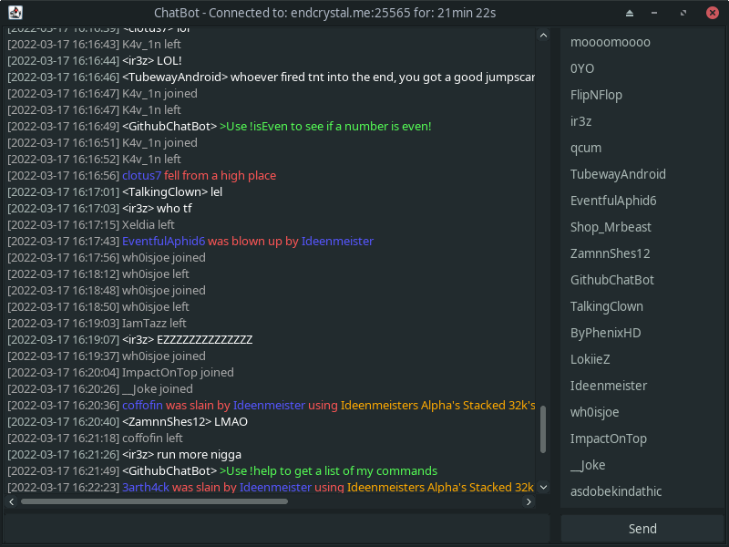

# Chat Bot
An external chat bot for Minecraft made in Java.



## Features
```
Multiple versions: All versions from 1.7.2 - 1.18.2 supported
Custom commands: Use custom.json to create custom commands
Auto-Reconnect: Automatically reconnect to the server if you get disconnected
Cracked server support: Lots of options in config.cfg that should allow the bot to get past any cracked server login
Anti-AFK: Prevent the bot from getting AFK kicked
SkinBlink: Randomly toggles the extra layers of the bot's player skin (just for fun)
Greentext: Turn Greentext chat on/off for the bot
Customizable prefix: Customize the prefix in the config.cfg file
```

## How to use
```
1. Put your login info file in the same directory as the jar (default login.txt)
2. Make sure your login info is set to email on the first line, password on the second (Or just username in first line for cracked)
3. Set the account type in config.cfg. (MSA for Microsoft and MOJ for Mojang/Cracked)
```
###### No gui
```
4. Open terminal and go to the jar's location
5. Type 'java -jar ChatBot.jar --nogui --ip=<ip/ip:port>'
```
###### With Gui
```
4. Double click the jar
5. Input the ip when prompted
```

## Commands
Below are a list of commands currently in ChatBot

###### 8ball -question-
Ask a question to the magic 8 ball
###### bible / pray
Print a random bible verse in chat
###### iseven -number-
Check if a number is even using the isEven API
###### coffee
Returns a link to a random picture of coffee
###### 2b2tcount -name- / !2b2t -name-
See how many times a player has mentioned 2b2t
###### coinflip / flip
Flip a coin
###### roulette / russianRoulette
Play Russian Roulette
###### report -name- -reason-
Report a player for bad behavior
###### plugins
Tries to get the server plugins and returns them
###### quote -name-
Gets a quote from that player
###### namemc -name-
Get the link for a NameMC search
###### skin -name-
Get the link to a player's skin, directly from Minecraft
###### lastname -name-
Tells you the most recently changed name of the player
###### bp / bestping
See who has the lowest ping on the server
###### wp / worstping
See who has the highest ping on the server
###### ping
Get your ping
###### ping -name-
Get the ping of another player
###### connected
Get the amount of time the bot has been connected
###### coords
Get the coords of the bot
###### coords -name-
Get the coords of another player
###### queue / q
Get the current length of 2b2t queue
###### kanye / ye
Get a random Kanye quote
###### dox -name-
Dox a player
###### resolve / ip -name-
Get a player's IP address
###### kys / kill
Make the bot commit suicide. (Uses the /suicide command)
###### tps
Get the current server TPS
###### cum
Make the bot cum
###### dupe -item-
Dupe any item! Unpatched on all servers 2019 no survey!
###### votekill -name-
Start a vote to kill a player. Vote with /kill
###### reload
Reload the bot commands, config and processes
###### help
Links to here
